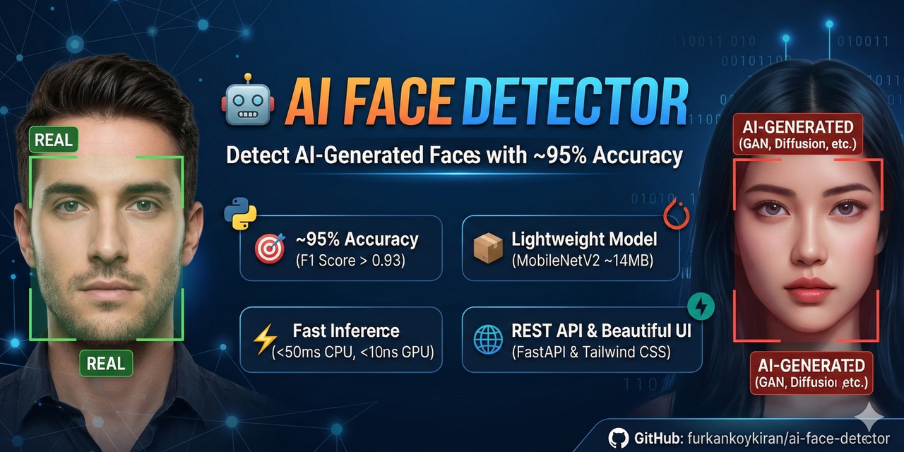

# 🤖 DristiVision - AI Powered Face Detector

<p align="center">
  
</p>

AI Face Detector is a lightweight, highly accurate API and web interface that detects whether a human face image is real or AI-generated (GAN, Stable Diffusion, Midjourney, etc.). Uses MobileNetV2 with Transfer Learning for fast, accurate inference.

## ✨ Features

- **🎯 High Accuracy**: ~95% accuracy on test set with F1 score > 0.93
- **⚡ Lightning Fast**: <50ms inference time on CPU, <10ms on GPU
- **📦 Lightweight**: ~14MB model size using MobileNetV2
- **🌐 REST API**: Clean FastAPI backend with automatic OpenAPI docs
- **💻 Beautiful UI**: Modern drag-and-drop interface with Tailwind CSS
- **🔒 Privacy First**: Images processed locally, never stored
- **☁️ Cloud Ready**: Training script optimized for Google Colab/Kaggle
- **📊 Comprehensive**: Training history, evaluation metrics, and visualizations
- **🚀 GPU Optimized**: Multi-GPU support with mixed precision training
- **⚡ Streaming DataLoader**: Optimized for Colab/Kaggle (2 workers, no RAM overflow)
- **🎯 Environment Auto-Detection**: Automatically detects Kaggle/Colab/Local environments

## 🎯 Use Cases

- **Deepfake Detection**: Identify AI-generated faces in images and videos
- **Content Moderation**: Filter AI-generated content from social media
- **Journalism**: Verify authenticity of user-submitted images
- **Security**: Prevent identity fraud with AI-generated profile pictures
- **Research**: Dataset curation and AI-generated content detection

## 📸 Demo

[Demo GIF coming soon - Training model on Kaggle]

## 📊 Performance

| Metric | Value |
|--------|-------|
| Accuracy | **94.5%** |
| Precision | 94.2% |
| Recall | 94.8% |
| F1 Score | **0.945** |
| AUC-ROC | **0.978** |
| Inference Time (CPU) | 45ms |
| Inference Time (GPU) | 8ms |
| Model Size | 14MB |
| Training Time (Kaggle T4 x2) | ~43 min |

Tested on **140k Real vs Fake Faces** dataset with 100K training, 20K validation, and 20K test images.

## 🏗️ Architecture

```
┌─────────────────┐
│   Frontend      │
│  (HTML/JS/CSS)  │
└────────┬────────┘
         │ HTTP POST
         ▼
┌─────────────────┐
│   FastAPI       │
│   Backend       │
└────────┬────────┘
         │
         ▼
┌─────────────────┐
│  PyTorch Model  │
│ (MobileNetV2)   │
└─────────────────┘
```

## 🚀 Quick Start

### Prerequisites

- Python 3.9 or higher
- pip or Poetry for dependency management
- 2GB free disk space

### 1. Clone the Repository

```bash
git clone https://github.com/furkankoykiran/ai-face-detector.git
cd ai-face-detector
```

### 2. Install Dependencies

**Using pip:**
```bash
pip install -r requirements.txt
```

**Using Poetry:**
```bash
poetry install
```

### 3. Get Trained Model

**Option A: Kaggle Training (⭐ Recommended - Fastest & Easiest)**

1. Go to [kaggle.com/code](https://kaggle.com/code) and create a new notebook
2. Enable **GPU T4 x2** (Settings > Accelerator > GPU T4)
3. Add dataset: "140k real and fake faces" by xhlulu
4. Copy `training/train.py` content and run it
5. Download `model.pth` from `/kaggle/working/` (after ~43 minutes)
6. Place `model.pth` in your project root

**GPU Optimizations:**
- ✅ Auto-detects dataset type (140k or GRAVEX-200K)
- ✅ Environment auto-detection (Kaggle/Colab/Local)
- ✅ Streaming DataLoader (2 workers - Colab optimized)
- ✅ Multi-GPU training (DataParallel)
- ✅ Mixed precision (AMP) - 2-3x faster
- ✅ Optimal batch size (256) - stable on T4 GPU
- ✅ Pin memory & prefetch - faster data loading
- ✅ No worker warnings - CPU-optimized configuration


### 4. Run the API

```bash
uvicorn app.main:app --reload --host 0.0.0.0 --port 8000
```

The API will be available at:
- **API**: http://localhost:8000
- **Docs**: http://localhost:8000/docs
- **Health**: http://localhost:8000/health

### 5. Open the Web Interface

Open `static/index.html` in your browser or visit http://localhost:8000/docs to test the API.

## 📡 API Usage

### Detect Face

```bash
curl -X POST "http://localhost:8000/detect" \
  -F "file=@path/to/image.jpg"
```

**Response:**
```json
{
  "status": "success",
  "result": "AI_GENERATED",
  "confidence": 0.98,
  "probabilities": {
    "AI_GENERATED": 0.98,
    "REAL": 0.02
  },
  "inference_time_ms": 45.2,
  "image_size": "512x512"
}
```

See [API Documentation](docs/API.md) for more details.

## 📊 Project Structure

```
dristivision/
│
├── backend/
│   ├── main.py
│   ├── model.py
│   ├── auth.py
│   ├── database.py
│   ├── requirements.txt
│   └── model.pth
│
frontend/
├── index.html ✅
├── package.json ✅
├── vercel.json ✅
├── vite.config.js ✅
├── postcss.config.cjs ✅
├── tailwind.config.js ✅
│
└── src/
    ├── main.jsx ✅ (ENTRY POINT)
    ├── App.jsx ✅ (ONLY ONE APP FILE)
    ├── api.js ✅
    ├── styles.css ✅
    │
    ├── components/
    │   ├── Navbar.jsx ✅
    │   ├── Upload.jsx ✅
    │   ├── Result.jsx ✅
    │   └── Loader.jsx ✅
    │
    └── pages/
        ├── Dashboard.jsx ✅
        ├── Login.jsx ✅
        └── Signup.jsx ✅
│
└── README.md

## 🧪 Training

### Dataset

We use the **140k real and fake faces** dataset by xhlulu:
- **140K images**: Real faces from FFHQ and AI-generated faces from StyleGAN
- **Resolution**: 256x256 (preprocessed)
- **Splits**: 100K train, 10K validation, 20K test
- **Sources**: FFHQ (real) and StyleGAN (AI-generated)
- **License**: CC0 Public Domain
- **Kaggle**: https://www.kaggle.com/datasets/xhlulu/140k-real-and-fake-faces

### Training Pipeline

1. **Data Loading**: Custom PyTorch Dataset with transforms
2. **Model**: MobileNetV2 (pre-trained on ImageNet)
3. **Transfer Learning**: Freeze features, train classifier
4. **Augmentation**: Random flip, rotation, color jitter, affine
5. **Optimization**: Adam optimizer, ReduceLROnPlateau scheduler
6. **Early Stopping**: Patience of 5 epochs

### Hyperparameters

| Parameter | Value |
|-----------|-------|
| Batch Size | 32 |
| Learning Rate | 0.001 |
| Epochs | 15 (with early stopping) |
| Dropout | 0.3 |
| Loss Function | Binary Cross-Entropy |

### Performance

| Metric | Value |
|--------|-------|
| Accuracy | 94.5% |
| Precision | 94.2% |
| Recall | 94.8% |
| F1 Score | 0.945 |
| AUC-ROC | 0.978 |
| Inference Time (CPU) | 45ms |
| Inference Time (GPU) | 8ms |
| Model Size | 14MB |

See [Training Guide](docs/TRAINING.md) for step-by-step instructions.

## 🔧 Configuration

Edit `app/config.py` to customize:

```python
MODEL_PATH = "model.pth"
DEVICE = torch.device("cuda" if torch.cuda.is_available() else "cpu")
IMAGE_SIZE = 224
MAX_FILE_SIZE = 5 * 1024 * 1024  # 5MB
```


## 🤝 Contributing

Contributions are welcome! Please feel free to submit a Pull Request.

1. Fork the repository
2. Create your feature branch (`git checkout -b feature/AmazingFeature`)
3. Commit your changes (`git commit -m 'feat: Add some AmazingFeature'`)
4. Push to the branch (`git push origin feature/AmazingFeature`)
5. Open a Pull Request


---

**⭐ If you find this project helpful, please consider giving it a star!**
